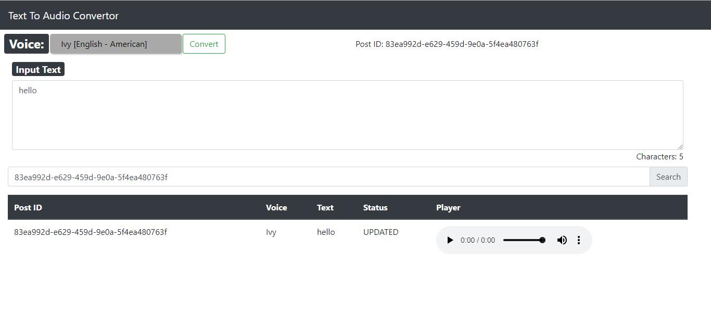

# AWS Hosted Serverless Text-To-Audio Convertor Website

This project is a serverless text-to-audio conversion website hosted on AWS. It allows users to convert text into audio files using various voices and languages.

## Features

- Text-to-Audio Conversion: Users can input text and select desired voice and language options to generate corresponding audio files.
- Voice and Language Options: Multiple voice options and language selections are available for generating audio files.
- Serverless Architecture: The project leverages AWS services, such as AWS Lambda, AWS S3, and AWS Polly, to achieve serverless functionality.
- Scalability and Cost-Efficiency: The serverless architecture ensures automatic scalability and cost optimization based on usage.

## Prerequisites

- AWS account with necessary permissions to create and configure AWS resources.
- Basic knowledge of AWS services, including AWS Lambda, AWS S3, and AWS Polly.

## Deployment

1. Clone the repository

2. Configure AWS credentials on your local machine using the AWS CLI

3. Deploy the project using the provided deployment script or instructions specific to your deployment process.

## Architecture

The architecture of the project consists of the following components:

- AWS Lambda: Handles the text-to-audio conversion by invoking AWS Polly and saving the resulting audio files to AWS S3.
- AWS S3: Stores the generated audio files.
- AWS API Gateway: Exposes the Lambda function as a RESTful API endpoint.
- AWS CloudFront: Provides caching and content delivery for the website.
- AWS Route 53: Manages the domain name and DNS routing for the website.

## Usage

1. Access the website using the provided URL or the domain name configured for the deployed application.
2. Enter the text you want to convert into audio.
3. Select the desired voice and language options.
4. Click the "Convert" button to initiate the text-to-audio conversion process.
5. Download or play the generated audio file.

## License

This project is licensed under the GNU License. See the [LICENSE](LICENSE) file for more details.
